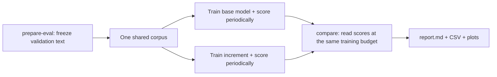

# Run an evaluation yourself

Evaluation asks: **after the same amount of training, which model predicts unseen
text better?** Train your base transformer, then train each increment from scratch
with the same training recipe and seeds. Score all of them on the same held-out text.
You can keep the baseline's scores and reuse them as you add increments.

There are three actions:

| Action | When you do it | What it produces |
|---|---|---|
| `prepare-eval` | Once for the study | A frozen set of validation tokens |
| `train --eval-config` | For every variant and seed | Model checkpoints and validation scores |
| `compare` | When the runs reach your chosen budget | Tables and plots comparing those scores |



Evaluation performs forward passes without learning from the validation text.
The training partition excludes that text. A checkpoint is the model at a particular
training step; an evaluation result is its score on the frozen corpus.

For GPU execution, use the [permanent Kaggle notebook](kaggle-notebook.md). It runs
the same CLI flow and exports result ZIPs for comparison on your local machine.

## 1. Try a small example on your machine

Run these commands from the repository root. They use the included tiny CPU model
and local text, with cloud logging disabled. This teaches the workflow before you
spend time training M1. Dependency installation may require Internet access.

```bash
uv sync --extra dev --extra eval

# Freeze the validation text once.
uv run nanoscope prepare-eval --config configs/test/eval/local-corpus.yaml

# Train the baseline and score it automatically every two steps and at the end.
uv run nanoscope train --config configs/test/eval/local-base.yaml \
  --eval-config configs/test/eval/local-validation.yaml --resume auto

# Train the second variant with the SAME evaluation config.
uv run nanoscope train --config configs/test/eval/local-variant.yaml \
  --eval-config configs/test/eval/local-validation.yaml --resume auto

# Read both runs' scores and generate the report.
uv run nanoscope compare --study configs/test/eval/local-periodic-study.yaml \
  --output runs/eval-walkthrough --plots
```

Open `runs/eval-walkthrough/report.md`. Each run trains for four steps. The second
variant changes dropout from 0.1 to 0.2; neither model is the M1 transformer.
`--resume auto` starts a missing run or resumes an existing one with the same config.
If you already finished one, it can fill in a missing final evaluation without
training it again. Do not edit that run's training config and then try to resume it.

The files connect like this:

```text
configs/test/eval/local-corpus.yaml         -> runs/eval-corpora/local-validation/
configs/test/eval/local-validation.yaml     -> reads that frozen corpus
configs/test/eval/local-base.yaml           -> runs/eval-local-base/evaluations/*.json
configs/test/eval/local-variant.yaml        -> runs/eval-local-variant/evaluations/*.json
configs/test/eval/local-periodic-study.yaml -> reads those two result directories
compare                                   -> runs/eval-walkthrough/report.md
```

You do not need to run `evaluate` separately when `train --eval-config` has already
written the scores. `compare` only reads scores; it does not launch training or score
checkpoints for you. Each JSON filename is a result fingerprint, not something you
need to name yourself. Study files can select all result files with `*.json`.

## 2. Copy the templates for your own experiment

The templates use quoted `@/` paths, so you can move their copies anywhere inside
the project without counting `../` levels. For example, `"@/runs/evaluations"`
means the project's `runs/evaluations` directory. The root is the nearest parent
of the YAML containing `pyproject.toml` or `.git`. Start with these copies:

```bash
cp configs/experiment-template.yaml configs/my-base-seed-1337.yaml
cp configs/eval-corpus-template.yaml configs/my-corpus.yaml
cp configs/eval-template.yaml configs/my-eval.yaml
cp configs/eval-study-template.yaml configs/my-study.yaml
```

| File | What you choose |
|---|---|
| `my-base-seed-1337.yaml` | Model, run ID, seed, training data and training budget |
| `my-corpus.yaml` | Validation source, tokenizer, context length and amount of validation text |
| `my-eval.yaml` | Prepared corpus path, evaluation batch size, precision and scoring interval |
| `my-study.yaml` | Variant names, result paths, allowed model changes and comparison budget |

These templates use pinned FineWeb-Edu and GPT-2 tokenization. The training template
still uses `toy_lm` as a placeholder: replace `model.name` and `model.params` with your
registered base transformer when it exists. No YAML inheritance or placeholder
substitution happens automatically.

In the training copy, set `run.id: my-base-seed-1337`. For local runs, also set
`run.output_dir: "@/runs"`, `checkpoint.hub_policy: disabled` and
`logging.wandb_mode: disabled`. Choose the training device and worker count for your
machine. The template defaults to CUDA/FP16 and enables the training partition.
It requires a clean Git worktree, so commit your model and edited configs before
starting a research run.

Keep the dataset/revision, tokenizer, context length and partition scheme identical
between training and corpus configs. Only `data.partition.split` differs: `train`
in training, `validation` in the corpus. The corpus template already matches the
experiment template's defaults. Changing the partition requires a new training run.

Prepare the corpus once:

```bash
uv run nanoscope prepare-eval --config configs/my-corpus.yaml
```

Paste its printed fingerprint into `corpus_hash` in `my-eval.yaml`. Commit that
config, then train:

```bash
uv run nanoscope train --config configs/my-base-seed-1337.yaml \
  --eval-config configs/my-eval.yaml --resume auto
```

Evaluation uses that same prepared corpus at each scheduled step. On Kaggle, point
`corpus` to the prepared corpus's actual location. Periodic results follow the
training `run.output_dir`; download the run artifacts and update study paths if you
compare on a different machine. See the [full guide](evaluation.md) for persistence.

## 3. Add a component and compare

Copy your base training config to `configs/my-plus-component-seed-1337.yaml`.
Set `run.id: my-plus-component-seed-1337` and change the model implementation/config
for that component. Keep seed 1337, training data, optimizer, schedule and budget
unchanged. Train this new run from scratch using `my-eval.yaml` again:

```bash
uv run nanoscope train --config configs/my-plus-component-seed-1337.yaml \
  --eval-config configs/my-eval.yaml --resume auto

uv run nanoscope compare --study configs/my-study.yaml \
  --output runs/my-comparison --plots
```

The study template already looks for `my-base-seed-*` and
`my-plus-component-seed-*` run IDs. Its `base` and `plus-component` labels are display
names, independent of the registered model name. Add another entry after training
the next increment, in the order you want the increments compared.

The default comparison budget is **2,048,000 training tokens**:

```text
1000 steps × 4 global batch × 4 gradient accumulation × 128 context = 2,048,000
```

If you change those training settings, update `budget` in the study too. The
**1,048,576 validation tokens** in the corpus template are a separate quantity:
they control how much held-out text each scoring pass reads. The same validation
text is reused at every evaluation.

## 4. Repeat seeds and read the result

One seed per variant is enough to check that the workflow works. To assess whether
the gain repeats, make training-config copies for seeds **1337, 2024 and 42**:

| Seed | Base run ID | Increment run ID |
|---|---|---|
| 1337 | `my-base-seed-1337` | `my-plus-component-seed-1337` |
| 2024 | `my-base-seed-2024` | `my-plus-component-seed-2024` |
| 42 | `my-base-seed-42` | `my-plus-component-seed-42` |

Change both `run.id` and `run.seed` in each copy and train each with `my-eval.yaml`.
Keep every other field within a variant the same. A seed in the filename alone
does not change training randomness. The study globs collect these runs automatically;
run `compare` again when every seed reaches the budget.

Read `report.md` in this order:

1. **CE (nats)** is validation prediction loss. Lower is better. Perplexity expresses
   the same loss on another scale; it is also lower-is-better.
2. **Delta baseline** subtracts the baseline's loss for the same seed. For example,
   `3.40 - 3.50 = -0.10` means the increment improved by 0.10 nats/token.
3. **Delta previous** compares with the preceding entry in your study. This tells
   you what the latest addition contributed on top of earlier additions.
4. **Paired seed differences** summarizes those differences across seeds. A 95%
   interval entirely below zero supports an improvement under the method's assumptions;
   one crossing zero leaves the direction uncertain. One or two pairs are labeled
   exploratory. Three pairs are a minimum, not a guarantee of a reliable conclusion.
5. **Throughput and memory** in `comparison.csv` show the cost. Check
   `speed_comparable` before using throughput to choose between runs.

A model with lower loss may also be slower or larger. Decide whether the measured
quality gain justifies that cost. Keep your final test partition untouched while
making these development choices. The [full guide](evaluation.md) explains the
statistical assumptions, FLOP matching and reproducibility details.

If you have checkpoints but no scores, use the standalone route:

```bash
uv run nanoscope evaluate \
  --checkpoint runs/my-base-seed-1337/checkpoints/step_00001000 \
  --eval-config configs/my-eval.yaml
```

Repeat for the other runs, then change the study's result globs to
`"@/runs/evaluations/my-base-seed-*/*.json"` and the corresponding increment path.
Standalone scores use `output` from `my-eval.yaml`; periodic scores use each training
run's `evaluations/` directory. Choose one source per checkpoint to avoid ambiguity.
